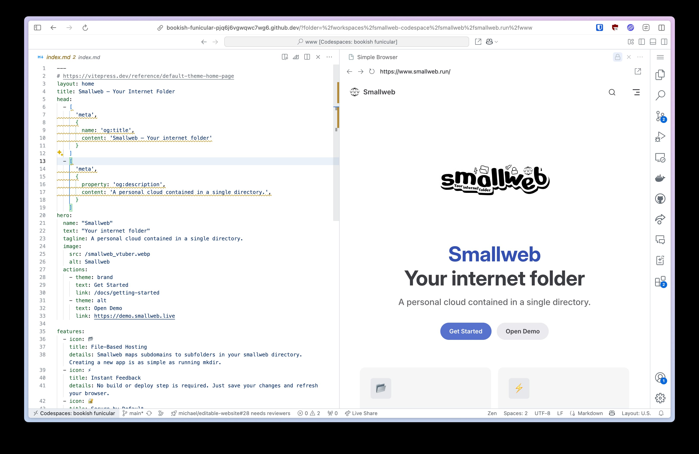

# Smallweb Codespace

## Usage

1. Fork this repository
1. Generate an ssh key pair using `ssh-keygen -t ed25519`
1. Store the private key in a codespace secret named `SSH_PRIVATE_KEY`
1. Add the public key to the `authorized_keys` file on the server
1. Update the `.devcontainer/ssh_config` file with the server's details
1. Run the `Create Sync` command to sync the workspace with the server
